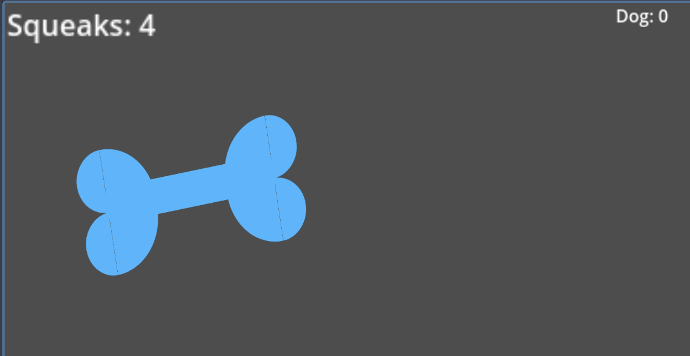

# Project Cuprum Journal
### Day 1 (Game, 5/1/25)
Make basic elements of a clicker game. It adds points to your score. Not much else. Dang this Godot thing is much easier
than i initially thought (Time Logged: 10m, most likely more as i had issues with it logging time for the core "Cuprum" 
project instead of the Squeaky Clicker one.)
